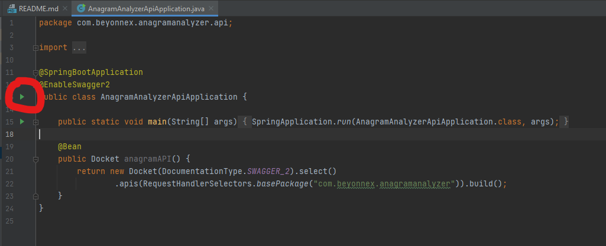

# Anagram Analyzer 

This SpringBoot application is a simple that allows the user 
to call APIs that
1. Detect if two words are an anagram. 
2. Retrieve historical anagrams previously detected by the application itself and the user can search them introducing a single word as parameter.

This APIs can be called for example, from a fronted,
and inside the main logic to detect if two words are an anagram and the historicals 
are managed by an external library **<see https://github.com/francescofalanga/anagram-analyzer-app>**

## Prerequisite

Java 11 is required to run the application

## Guidelines

First of all, clone this repository in your local machine,
once you have done this, you can run the SpringBoot application
This API

### Run from the IDE

Once you have cloned the application in your local machine from git,
you can use any IDE and import the application.
To run the application, you need to run 
**AnagramAnalyzerApiApplication.java** SpringBoot main class
The path for the main class is /src/main/java/com/beyonnex/anagramanalyzer/api/AnagramAnalyzerApiApplication.java 

## Use the application

Once you run the SpringBoot application, the APIs will be available to be consumed
To see a small documentation of the APIs you can go to the documentation at the 
url **http://localhost:8080/swagger-ui.html#/**

You can call the two APIs

### Detect if two words are an anagram

Call the API: localhost:8080/api/v1/anagram?word1={replace_word_1}&word2={replace_word_2} 

### Retrieve the historical Anagrams

localhost:8080/api/v1/anagram/historical?word={replace_word}

### Use Postman
In the source code, you can find a **Postman Collection** to be imported
under the folder **/src/main/resources/postman_collections/Anagram Analyzer API collection.postman_collection.json**

## License
"This project is licensed under the terms of the **MIT** license. 
The code in this repository is covered by the included license.

## Support
Please contact falangafrancesco@gmail.com
